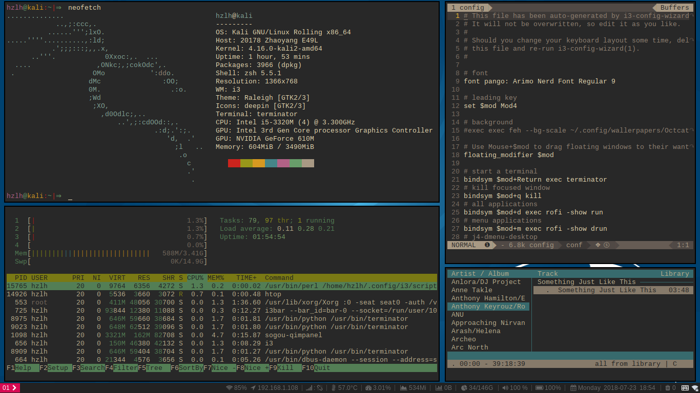
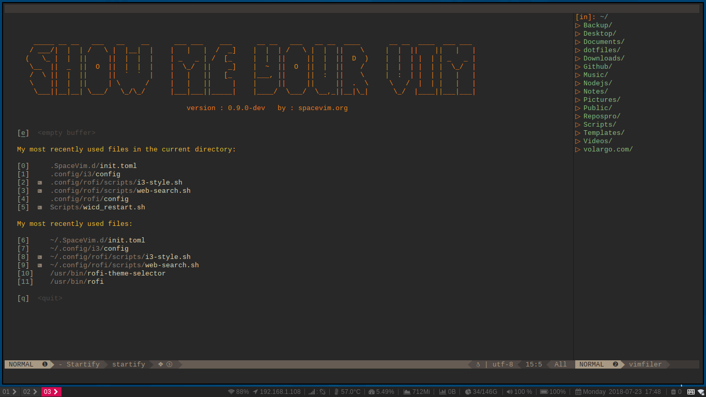

# About
A fast and easy-to-use configuare on the Linux (Debian/Kali/Ubuntu)

## Screenshots
* i3-wm 

* SpaceVim 

## Dependencies
* [i3-wm](https://github.com/i3/i3): improved dynamic tiling window manager.
* [i3-gaps](https://github.com/Airblader/i3): a tiling window manager for Linux.
* [i3blocks](https://github.com/vivien/i3blocks): highly flexible status line for the i3 window manager.
* [i3-style](https://github.com/acrisci/i3-style): make your i3 config a little more stylish.
* [i3lock-color](https://github.com/PandorasFox/i3lock-color): improved screen locker.
* [j4-dmenu-desktop](https://github.com/enkore/j4-dmenu-desktop): faster replacement for i3-dmenu-desktop.
* [rofi](https://github.com/DaveDavenport/rofi): window switcher, run dialog and dmenu replacement.

## Usage

## Install
1. Clone this repo somewhere and run `install.sh` scripts with `root`.
```Shell
$ git clone git@github.com:volargo/dotfiles.git ~/dotfiles
$ cd ~/dotfiles
$ chmod +x install.sh
$ ./install.sh
```
