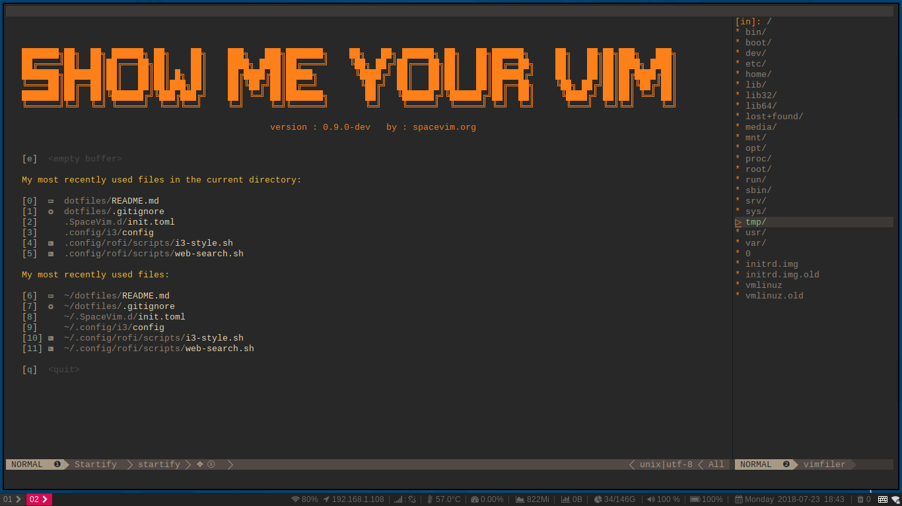

# About
A fast and easy-to-use configuare on the Debian Linux.

## Dependencies
* [i3-wm](https://github.com/i3/i3): improved dynamic tiling window manager.
* [i3-gaps](https://github.com/Airblader/i3): a tiling window manager for Linux.
* [i3blocks](https://github.com/vivien/i3blocks): highly flexible status line for the i3 window manager.
* [i3-style](https://github.com/acrisci/i3-style): make your i3 config a little more stylish.
* [i3lock-color](https://github.com/PandorasFox/i3lock-color): improved screen locker.
* [j4-dmenu-desktop](https://github.com/enkore/j4-dmenu-desktop): faster replacement for i3-dmenu-desktop.
* [rofi](https://github.com/DaveDavenport/rofi): window switcher, run dialog and dmenu replacement.
* [deepin-screenshot](https://github.com/linuxdeepin/deepin-screenshot): screenshots application.

## Screenshots
* i3-wm 

* SpaceVim 

## Usage
**Keybindings**

|Key                    |Action                             |
|:----------------------|:----------------------------------|
|`$Mod+d`               |Application launcher|
|`$Mod+m`               |Desktop file application launcher|
|`$Mod+t`               |Select rofi theme|
|`$Mod+F5`              |Notes|
|`$Mod+F6`              |Web search|
|`$Mod+Tab`             |Window Switcher|
|`$Mod+Print`           |Screenshots|
|`$Mod+r`               |Resize application window|
|`Pause`                |System power controler|

More i3-wm themes, use `i3-style` change this. For example(select debian theme):
```
$ i3-style debian -o ~/.config/i3/config --reload
```

Modify the power controller can pass the custom i3 configuration file, open ` i3` configuration file and find below code then change keybindings.
```shell
mode "$mode\_system" {
    bindsym L exec bash -f ~/.config/i3/scripts/lock.sh, exec sleep .1 && exec xset dpms force off, mode "default"
    bindsym E exec i3-msg exit
    bindsym P exec systemctl poweroff
    bindsym R exec systemctl reboot
    bindsym H exec lock && systemctl hibernate
    bindsym S exec lock && systemctl suspend
    bindsym Escape mode "default"
    bindsym Return mode "default"
}
bindsym Pause mode "$mode\_system"
```


## Install
1. Clone this repo somewhere and run `install.sh` scripts with `root`.
```Shell
$ git clone git@github.com:volargo/dotfiles.git ~/dotfiles
$ cd ~/dotfiles
$ chmod +x install.sh
$ ./install.sh
```
